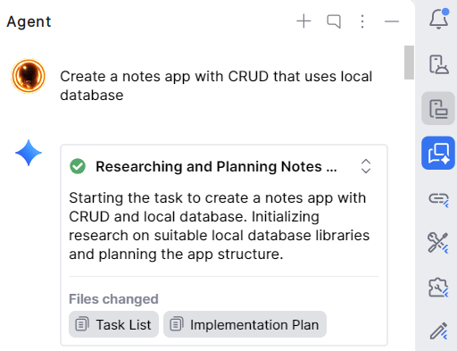
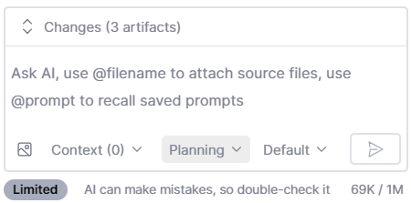

### **Prerequisites**
*   Ensure that your **Android Studio** is up-to-date.

---

### **Step-by-Step Guide**

1.  **Initialize the Project**  
    Create a new Flutter project in Android Studio.

2.  **Open the Agent Interface**  
    Navigate to the right-hand sidebar and select the **Agent** tool window.  
    

3.  **Enable Planning Mode**  
    Within the Agent interface, verify that you are currently in **Planning Mode** before proceeding.  
    

4.  **Execute the Prompt Sequence**  
    Enter the following prompts one by one, allowing the Agent to fully process each request before submitting the next:
    
    > *   "Create a Flutter notes app with CRUD that uses a local database."
    > *   "Now let's plan again. How does one refine, enrich, and beautify the looks of the interface, the UI?"
    > *   "Wonderful, what if we seek to not only beautify even more, but enhance the app experience even more? What should we add?"
    > *   "Can you please create a few separate pages? And what would their functions be?"
    > *   "Please ensure separate files for each page, and then use the import. Proper files and folder structure."

5.  **Review and Implement**  
    Wait for the Agent to finish formulating. Once the plans have been generated, thoroughly review the proposed steps, and then approve them to begin implementation.
---

### Disclaimer
The agent might produce faulty code, especially regarding the frontend. In those cases, feel free to debug by yourself, or just point out the issue to the agent again. Send the error screenshot or copy the error message.

## Additional Knowledge
<blockquote class="twitter-tweet">
🚨 STOP BURNING YOUR TOKENS!  If you use Claude Code, you are probably wasting 80% of your context window.  I found 10 ace tools that will completely rescue your API bill.  1. Caveman Claude - Literally makes Claude talk like a caveman - Slashes 75% of output tokens with zero… <a href="https://t.co/wzCP8JpvIn">https://t.co/wzCP8JpvIn</a> <a href="https://t.co/Vhy3OqthVY">pic.twitter.com/Vhy3OqthVY</a>
&mdash; Charly Wargnier (@DataChaz) <a href="https://twitter.com/DataChaz/status/2045784379155226971?ref_src=twsrc%5Etfw">April 19, 2026</a></blockquote> 

🚨 STOP BURNING YOUR TOKENS!

If you use Claude Code, you are probably wasting 80% of your context window.

I found 10 ace tools that will completely rescue your API bill.

1. Caveman Claude
- Literally makes Claude talk like a caveman
- Slashes 75% of output tokens with zero loss in accuracy
Repo → http://github.com/juliusbrussee/caveman

2. RTK (Rust Token Killer)
- A blazing fast proxy that filters terminal output
- 60-90% reduction and completely dependency-free
Repo → http://github.com/rtk-ai/rtk

3. Code Review Graph
- Claude reads only what matters using a Tree-sitter graph
- An unbelievable 49x token reduction on huge monorepos
Repo → http://github.com/tirth8205/code-review-graph

4. Context Mode
- Sandboxes raw output into SQLite instead of your context
- A staggering 98% context reduction on logs & GitHub
Repo → http://github.com/mksglu/context-mode

5. Claude Token Optimizer
- Brilliant setup prompts that optimize any project
- 90% token savings, taking docs from 11K to 1.3K
Repo → http://github.com/nadimtuhin/claude-token-optimizer

6. Token Optimizer
- Hunts down the invisible ghost tokens eating your context
- Fully restores and protects your context quality
Repo → http://github.com/alexgreensh/token-optimizer

7. Token Optimizer MCP
- Adds aggressive caching and compression to your MCP tools
- 95%+ token reduction through pure intelligence
Repo → http://github.com/ooples/token-optimizer-mcp

8. Claude Context
- Zilliz’s hybrid vector search MCP
- Makes your entire codebase the context for 40% less cost
Repo → http://github.com/zilliztech/claude-context

9. Claude Token Efficient
- Just drop one CLAUDE.md file into your repo
- Enforces strict terseness with zero code changes
Repo → http://github.com/drona23/claude-token-efficient

10. Token Savior
- Navigates your code by symbols, not giant files
- 97% reduction on code navigation with persistent memory
Repo → http://github.com/mibayy/token-savior

----

[ The god-tier stack ]
Pick 2-3 based on what’s draining you:
> Massive repo? Code Review Graph + Token Savior
> Heavy terminal output? RTK
> MCP data dumps? Context Mode
> Need an instant fix? Caveman + Claude Token Efficient

Most devs are bleeding tokens.

Run `/context` in a fresh session and watch the savings roll in 👀
