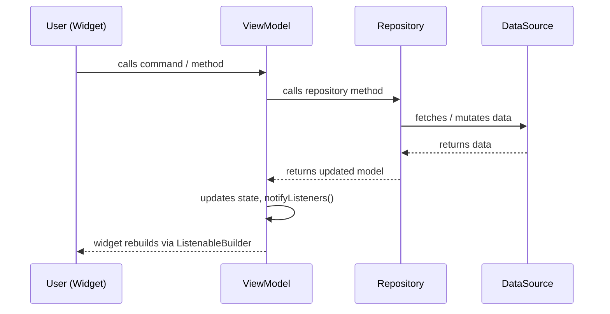
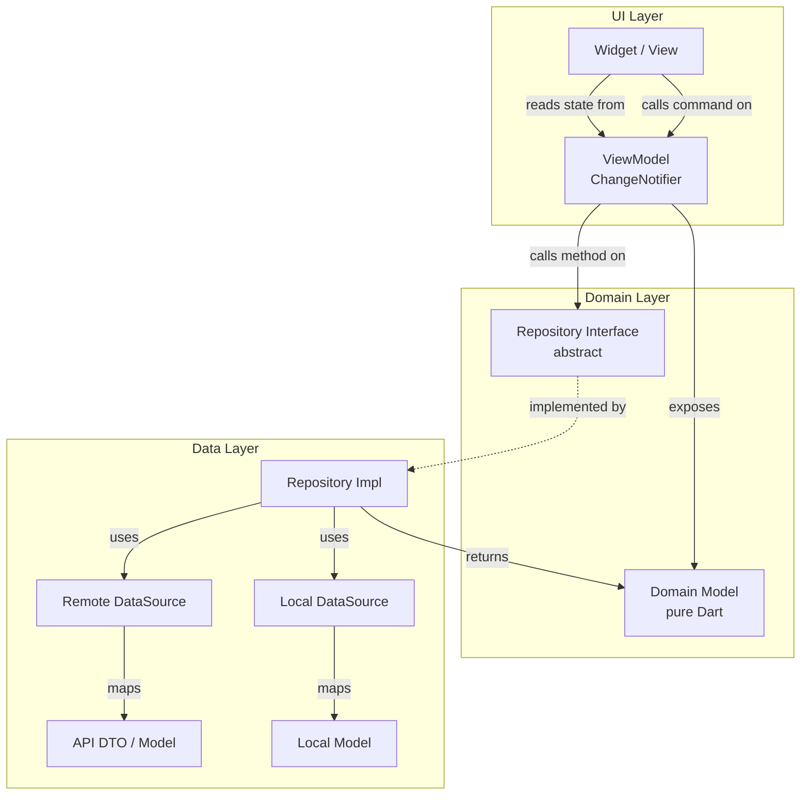
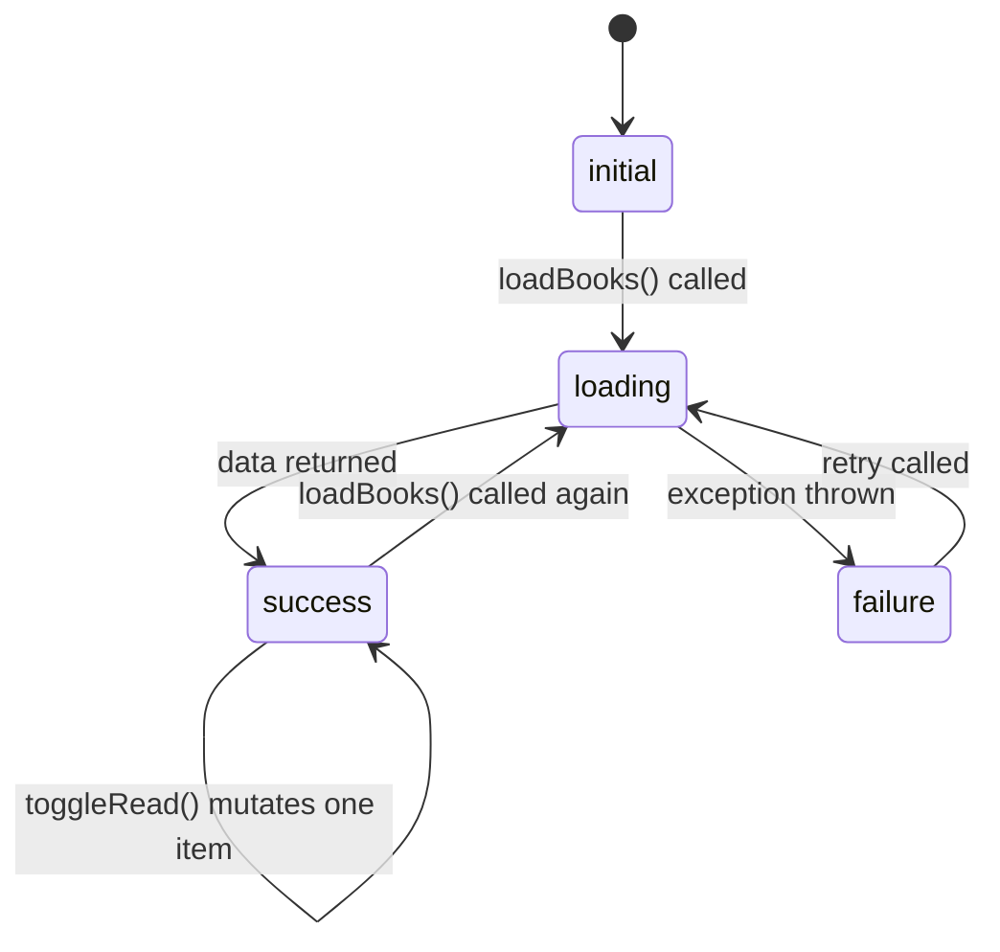
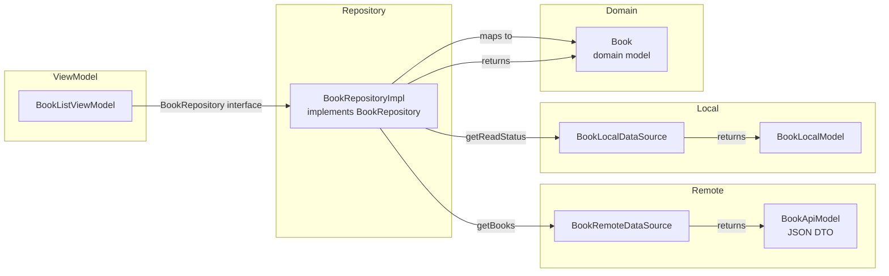
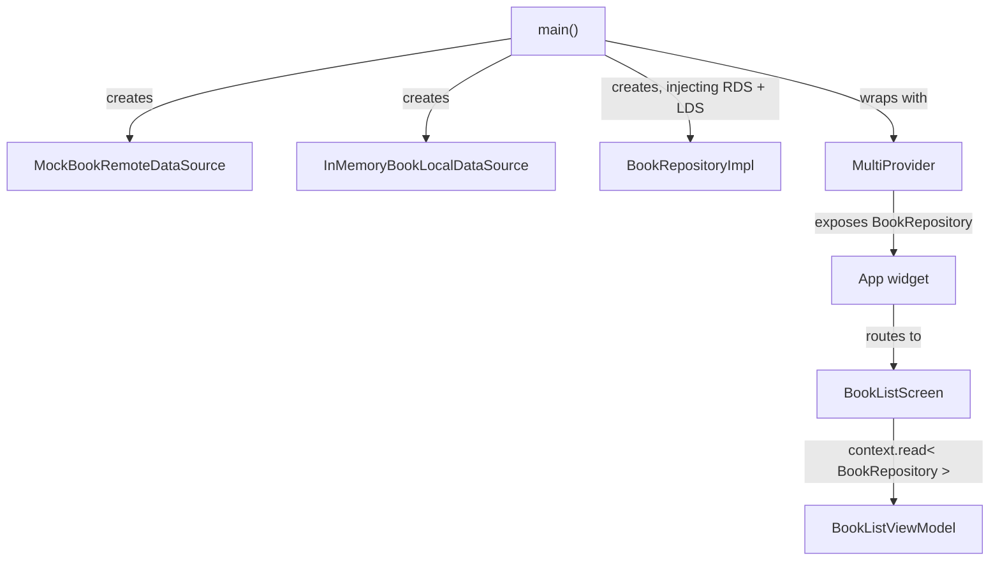
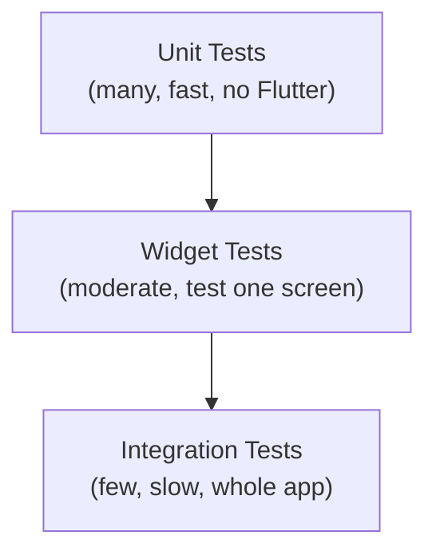

# Flutter App Architecture

A comprehensive learning guide to Flutter's recommended application architecture, based on [Flutter's official architecture documentation](https://docs.flutter.dev/app-architecture).

---

## Table of Contents

1. [Overview — Why Architecture Matters](#1-overview--why-architecture-matters)
2. [Core Concepts](#2-core-concepts)
3. [UI Layer](#3-ui-layer)
4. [Data Layer](#4-data-layer)
5. [Dependency Injection](#5-dependency-injection)
6. [Testing Strategy](#6-testing-strategy)
7. [Architecture Decision Record](#7-architecture-decision-record)

---

## 1. Overview — Why Architecture Matters

As a Flutter app grows beyond a single screen and a single developer, ad-hoc "write it anywhere" code creates a tangle of logic, state, and UI that is painful to change and nearly impossible to test. Intentional architecture solves four concrete problems:

| Problem                                                 | Architectural solution                                         |
| ------------------------------------------------------- | -------------------------------------------------------------- |
| Hard to change one thing without breaking another       | Separation of concerns — each class has one job                |
| Two widgets showing different versions of the same data | Single source of truth — one authoritative owner per data type |
| Hard to reason about when/why state changes             | Unidirectional data flow — changes travel one direction only   |
| Tests are flaky or impossible to write                  | Testable seams — inject fake dependencies at every boundary    |

Flutter's recommended architecture is **MVVM (Model-View-ViewModel)** organised in three layers:

```
┌─────────────────────────────────────┐
│           UI Layer                  │
│   Widget (View) ↔ ViewModel         │
├─────────────────────────────────────┤
│       Domain Layer (optional)       │
│   Pure Dart models + interfaces     │
├─────────────────────────────────────┤
│           Data Layer                │
│   Repository ↔ DataSource/Service   │
└─────────────────────────────────────┘
```

Each layer only talks to the layer directly below it. The UI layer never calls a DataSource directly.

---

## 2. Core Concepts

### 2.1 Separation of Concerns

Every class has **one reason to change**. A widget changes because the UI design changes. A ViewModel changes because the user-interaction logic changes. A Repository changes because the caching strategy changes. These are different reasons — so they live in different classes.

In practice this means:

- Widgets contain zero business logic.
- ViewModels contain zero Flutter widgets.
- Repositories are unaware of UI state.

### 2.2 Single Source of Truth (SSOT)

Every piece of data in the app has **exactly one authoritative owner**. Only that owner mutates the data. Consumers read from the owner; they never hold their own private copy.

In Flutter apps, the Repository is the SSOT for a given data type. If two ViewModels need the same data, they both read from the same Repository — they do not copy the data locally.

```dart
// Correct — both ViewModels read from the same repository
class BookListViewModel extends ChangeNotifier {
  BookListViewModel({required BookRepository repo}) : _repo = repo;
  final BookRepository _repo;
}

class BookDetailViewModel extends ChangeNotifier {
  BookDetailViewModel({required BookRepository repo}) : _repo = repo;
  final BookRepository _repo;
}

// Wrong — ViewModel caches its own copy of data
class BookListViewModel extends ChangeNotifier {
  final List<Book> _myPrivateCopy = []; // ← violates SSOT
}
```

### 2.3 Unidirectional Data Flow (UDF)

Data flows in one direction: **down** from the data layer to the UI. Events flow **up** from the UI to the data layer. The cycle never reverses.



### 2.4 Testability

Architecture is testable when each component's dependencies are **injected, not created**. A ViewModel that receives a `BookRepository` interface can be tested with a fake. A ViewModel that creates its own `http.Client` cannot.

```dart
// Testable — dependency is injected
class BookListViewModel extends ChangeNotifier {
  BookListViewModel({required BookRepository repo}) : _repo = repo;
}

// In test:
final vm = BookListViewModel(repo: FakeBookRepository());

// Not testable — dependency is created internally
class BookListViewModel extends ChangeNotifier {
  final _repo = BookRepositoryImpl(ApiClient()); // ← cannot swap for fake
}
```

### 2.5 Top-Level Architecture Diagram



---

## 3. UI Layer

The UI layer has two responsibilities: **display state** and **capture events**. It is divided into:

- **View (Widget)**: Renders the current state. Contains only layout and animation logic.
- **ViewModel**: Holds UI state, calls repository methods, and exposes commands.

### 3.1 ViewModel Responsibilities

A ViewModel:

1. Takes repositories (or use-cases) as constructor arguments.
2. Exposes **read-only** state via getters.
3. Exposes **commands** (async methods) for user interactions.
4. Calls `notifyListeners()` after state changes.
5. Never imports anything from `package:flutter/widgets.dart`.



### 3.2 ViewModel Code Example

```dart
/// Possible loading states for the book list.
enum BookListStatus { initial, loading, success, failure }

/// ViewModel for the book list screen.
///
/// Retrieves books from [BookRepository] and exposes UI-ready state.
/// No Flutter imports — pure Dart.
class BookListViewModel extends ChangeNotifier {
  BookListViewModel({required BookRepository bookRepository})
      : _repository = bookRepository;

  final BookRepository _repository;

  BookListStatus _status = BookListStatus.initial;
  List<Book> _books = [];
  String? _error;

  BookListStatus get status => _status;
  // Expose an unmodifiable view — callers cannot mutate the internal list.
  List<Book> get books => List.unmodifiable(_books);
  String? get error => _error;

  /// Loads all books from the repository.
  Future<void> loadBooks() async {
    _status = BookListStatus.loading;
    _error = null;
    notifyListeners();

    try {
      _books = await _repository.getBooks();
      _status = BookListStatus.success;
    } catch (e) {
      _error = e.toString();
      _status = BookListStatus.failure;
    }

    notifyListeners();
  }

  /// Toggles the read status of the book identified by [bookId].
  Future<void> toggleRead(String bookId) async {
    try {
      final updated = await _repository.toggleRead(bookId);
      final index = _books.indexWhere((b) => b.id == bookId);
      if (index != -1) {
        _books = List.of(_books)..[index] = updated;
        notifyListeners();
      }
    } catch (e) {
      _error = e.toString();
      notifyListeners();
    }
  }
}
```

### 3.3 View Code Example

The widget uses `Consumer<ViewModel>` (or `ListenableBuilder`) to rebuild only when state changes. No logic lives here — only display and event delegation.

```dart
/// Book list screen.
///
/// Displays the ViewModel state; delegates all interactions to the ViewModel.
class BookListScreen extends StatefulWidget {
  const BookListScreen({super.key});

  @override
  State<BookListScreen> createState() => _BookListScreenState();
}

class _BookListScreenState extends State<BookListScreen> {
  @override
  void initState() {
    super.initState();
    // Load data after the first frame so context.read() is safe.
    WidgetsBinding.instance.addPostFrameCallback((_) {
      context.read<BookListViewModel>().loadBooks();
    });
  }

  @override
  Widget build(BuildContext context) {
    return Scaffold(
      appBar: AppBar(title: const Text('BookShelf')),
      body: Consumer<BookListViewModel>(
        builder: (context, viewModel, _) {
          return switch (viewModel.status) {
            BookListStatus.initial ||
            BookListStatus.loading =>
              const Center(child: CircularProgressIndicator()),
            BookListStatus.failure => Center(
                child: Column(
                  mainAxisSize: MainAxisSize.min,
                  children: [
                    Text(viewModel.error ?? 'Unknown error'),
                    ElevatedButton(
                      onPressed: viewModel.loadBooks,
                      child: const Text('Retry'),
                    ),
                  ],
                ),
              ),
            BookListStatus.success => ListView.builder(
                itemCount: viewModel.books.length,
                itemBuilder: (_, i) => ListTile(
                  title: Text(viewModel.books[i].title),
                  trailing: Checkbox(
                    value: viewModel.books[i].isRead,
                    onChanged: (_) =>
                        viewModel.toggleRead(viewModel.books[i].id),
                  ),
                ),
              ),
          };
        },
      ),
    );
  }
}
```

### 3.4 Common Pitfalls

| Pitfall                                 | Fix                                               |
| --------------------------------------- | ------------------------------------------------- |
| Calling `BuildContext` inside ViewModel | Pass data via method argument; never pass context |
| Business logic in `build()`             | Move to ViewModel method                          |
| ViewModel creating its own repositories | Always inject via constructor                     |
| Exposing mutable lists (`_books`)       | Return `List.unmodifiable(_books)`                |
| Forgetting `notifyListeners()`          | Call it in both success and error paths           |

---

## 4. Data Layer

The data layer is the **single source of truth** for all app data. It is split into two sublayers:

- **Repository**: Owns one data type. Merges remote and local sources. Maps DTOs to domain models.
- **DataSource / Service**: Talks to exactly one external system (a REST API, a database, the device's file system).

### 4.1 Model vs Entity (DTO vs Domain Model)

| Concept                            | Location        | Purpose                                             |
| ---------------------------------- | --------------- | --------------------------------------------------- |
| **API DTO** (`BookApiModel`)       | `data/remote/`  | Mirrors JSON wire format. Has `fromJson`/`toJson`.  |
| **Local Model** (`BookLocalModel`) | `data/local/`   | Mirrors local storage format.                       |
| **Domain Model** (`Book`)          | `domain/model/` | Pure Dart. No JSON, no Flutter. Used by ViewModels. |

The Repository translates between DTO and domain model. ViewModels only ever see the domain model.

### 4.2 Data Layer Diagram



### 4.3 Repository Interface (Domain Layer)

The interface lives in `domain/` so the UI layer can depend on it without depending on any data-layer implementation:

```dart
/// Abstract contract for book data access.
///
/// Lives in the domain layer. The data layer provides the implementation.
abstract interface class BookRepository {
  /// Returns all books, merging remote metadata with local read status.
  Future<List<Book>> getBooks();

  /// Returns a single book by [id].
  Future<Book> getBook(String id);

  /// Flips the read status of [id] and returns the updated book.
  Future<Book> toggleRead(String id);
}
```

### 4.4 Repository Implementation

```dart
/// Concrete repository that merges remote API data with in-memory read status.
class BookRepositoryImpl implements BookRepository {
  BookRepositoryImpl({
    required BookRemoteDataSource remoteDataSource,
    required BookLocalDataSource localDataSource,
  })  : _remote = remoteDataSource,
        _local = localDataSource;

  final BookRemoteDataSource _remote;
  final BookLocalDataSource _local;

  @override
  Future<List<Book>> getBooks() async {
    final apiModels = await _remote.getBooks();
    // Map each DTO to a domain model, merging local read status.
    return apiModels.map((api) {
      final local = _local.getReadStatus(api.id);
      return Book(
        id: api.id,
        title: api.title,
        author: api.author,
        coverUrl: api.coverUrl,
        description: api.description,
        isRead: local?.isRead ?? false,
      );
    }).toList();
  }

  @override
  Future<Book> getBook(String id) async {
    final api = await _remote.getBook(id);
    final local = _local.getReadStatus(api.id);
    return Book(
      id: api.id,
      title: api.title,
      author: api.author,
      coverUrl: api.coverUrl,
      description: api.description,
      isRead: local?.isRead ?? false,
    );
  }

  @override
  Future<Book> toggleRead(String id) async {
    final book = await getBook(id);
    final newStatus = !book.isRead;
    _local.setReadStatus(id, newStatus);
    return book.copyWith(isRead: newStatus);
  }
}
```

### 4.5 DataSource Abstractions

```dart
/// Remote data source interface — wraps the network API.
abstract interface class BookRemoteDataSource {
  Future<List<BookApiModel>> getBooks();
  Future<BookApiModel> getBook(String id);
}

/// Mock implementation with simulated network delay.
class MockBookRemoteDataSource implements BookRemoteDataSource {
  @override
  Future<List<BookApiModel>> getBooks() async {
    await Future.delayed(const Duration(milliseconds: 800));
    return _mockData.map(BookApiModel.fromJson).toList();
  }

  @override
  Future<BookApiModel> getBook(String id) async {
    await Future.delayed(const Duration(milliseconds: 800));
    final json = _mockData.firstWhere((b) => b['id'] == id);
    return BookApiModel.fromJson(json);
  }

  static const _mockData = [
    {'id': '1', 'title': 'Clean Code', 'author': 'Robert C. Martin',
     'cover_url': '', 'description': 'A handbook of agile software craftsmanship.'},
    // ...
  ];
}
```

### 4.6 Common Pitfalls

| Pitfall                                        | Fix                                                      |
| ---------------------------------------------- | -------------------------------------------------------- |
| ViewModel calls DataSource directly            | Always go through the Repository                         |
| Domain model has `fromJson` / JSON annotations | DTOs handle serialisation; domain model stays pure       |
| Repository stores mutable public state         | Expose via getters; mutate only through explicit methods |
| One giant repository for all data              | One repository per data type                             |

---

## 5. Dependency Injection

### 5.1 Why DI Is Needed

Without DI, classes create their own dependencies. This bakes in concrete types, prevents testing, and makes swapping implementations (e.g. switching from a mock API to a real one) require changing internal code.

With constructor injection, every dependency is **declared in the constructor signature** and provided from outside. The class does not know — and does not care — how its dependency was built.

### 5.2 Manual DI with Provider

Flutter's recommended approach is `package:provider`. All dependencies are created in `main.dart` and exposed through `MultiProvider` at the root of the widget tree. Widgets retrieve them with `context.read<T>()`.



### 5.3 Wiring Dependencies in `main.dart`

```dart
void main() {
  // Step 1 — create data sources (no dependencies).
  final remoteDataSource = MockBookRemoteDataSource();
  final localDataSource  = InMemoryBookLocalDataSource();

  // Step 2 — create repository, injecting data sources.
  final bookRepository = BookRepositoryImpl(
    remoteDataSource: remoteDataSource,
    localDataSource:  localDataSource,
  );

  // Step 3 — expose via Provider at the widget-tree root.
  runApp(
    MultiProvider(
      providers: [
        // Register the abstract interface, backed by the concrete impl.
        Provider<BookRepository>(create: (_) => bookRepository),
      ],
      child: const App(),
    ),
  );
}
```

### 5.4 Creating ViewModels at Route Level

ViewModels are **not** global providers. They are created per-route so they are garbage-collected when the route is popped:

```dart
// In App.dart or your router
onGenerateRoute: (settings) {
  if (settings.name == '/detail') {
    final bookId = settings.arguments as String;
    return MaterialPageRoute(
      builder: (context) => ChangeNotifierProvider(
        // BookRepository is read from the root provider tree.
        create: (context) => BookDetailViewModel(
          bookRepository: context.read<BookRepository>(),
        ),
        child: BookDetailScreen(bookId: bookId),
      ),
    );
  }
  return null;
},
```

### 5.5 Rules for Dependency Direction

```
View       →  knows only its ViewModel
ViewModel  →  knows only Repository interfaces (never DataSources)
Repository →  knows DataSource interfaces (never ViewModels)
DataSource →  knows nothing about the rest of the app
```

Dependencies always point **downward**. Nothing in a lower layer ever imports from a higher layer.

### 5.6 Common Pitfalls

| Pitfall                                                    | Fix                                              |
| ---------------------------------------------------------- | ------------------------------------------------ |
| Global `GetIt` singletons                                  | Use `Provider` — lifetime is tied to widget tree |
| `context.read()` inside a ViewModel                        | Inject the repository in the constructor instead |
| Creating the repository inside the ViewModel               | Create it outside and inject it                  |
| Exposing the repository as a public field on the ViewModel | Keep it `final` and `private` (`_repo`)          |

---

## 6. Testing Strategy

The payoff of a layered architecture is that **every layer can be tested independently** by replacing its dependencies with fakes.

### 6.1 Testing Pyramid



### 6.2 Unit Testing ViewModels

ViewModels have no Flutter dependencies, so tests are plain Dart `test()` calls. Replace the repository with a hand-written **fake** (a class that implements the interface with controlled, synchronous data).

```dart
void main() {
  late BookListViewModel viewModel;
  late FakeBookRepository fakeRepo;

  setUp(() {
    fakeRepo = FakeBookRepository();
    viewModel = BookListViewModel(bookRepository: fakeRepo);
  });

  tearDown(() => viewModel.dispose());

  test('initial status is initial', () {
    expect(viewModel.status, BookListStatus.initial);
    expect(viewModel.books, isEmpty);
  });

  test('loadBooks transitions loading → success and fills books', () async {
    final statuses = <BookListStatus>[];
    viewModel.addListener(() => statuses.add(viewModel.status));

    await viewModel.loadBooks();

    expect(statuses, containsAllInOrder([
      BookListStatus.loading,
      BookListStatus.success,
    ]));
    expect(viewModel.books, isNotEmpty);
  });

  test('loadBooks sets failure when repo throws', () async {
    fakeRepo.shouldThrow = true;
    await viewModel.loadBooks();

    expect(viewModel.status, BookListStatus.failure);
    expect(viewModel.error, isNotNull);
  });

  test('toggleRead flips isRead on the correct book', () async {
    await viewModel.loadBooks();
    expect(viewModel.books.first.isRead, isFalse);

    await viewModel.toggleRead(viewModel.books.first.id);
    expect(viewModel.books.first.isRead, isTrue);
  });
}
```

### 6.3 Unit Testing Repositories

Repositories are tested by replacing their DataSources with fakes. The test verifies the mapping logic (DTO → domain model) and business rules (e.g. merging read status).

```dart
void main() {
  late BookRepositoryImpl repo;
  late FakeBookRemoteDataSource fakeRemote;
  late FakeBookLocalDataSource fakeLocal;

  setUp(() {
    fakeRemote = FakeBookRemoteDataSource();
    fakeLocal  = FakeBookLocalDataSource();
    repo = BookRepositoryImpl(
      remoteDataSource: fakeRemote,
      localDataSource:  fakeLocal,
    );
  });

  test('getBooks maps DTOs to domain models', () async {
    final books = await repo.getBooks();
    expect(books, isA<List<Book>>());
    expect(books.first.isRead, isFalse);
  });

  test('toggleRead persists new status to local store', () async {
    await repo.toggleRead('test-1');
    expect(fakeLocal.store['test-1'], isTrue);
  });

  test('getBooks reflects persisted read status', () async {
    fakeLocal.setReadStatus('test-1', true);
    final books = await repo.getBooks();
    expect(books.firstWhere((b) => b.id == 'test-1').isRead, isTrue);
  });
}
```

### 6.4 Fake (Hand-Written) vs Mock (Generated)

| Approach                                 | When to use                                     | Pros                           | Cons                                    |
| ---------------------------------------- | ----------------------------------------------- | ------------------------------ | --------------------------------------- |
| **Fake** (implements interface manually) | Repositories, DataSources                       | Simple, readable, no codegen   | More boilerplate per class              |
| **Mock** (mockito / mocktail)            | Complex objects like routers, platform channels | Fine-grained call verification | Requires `build_runner`, generated code |

Flutter's official guidance favours **fakes** for data layer interfaces and mocks only when you need to verify call order or specific arguments.

### 6.5 Widget Testing with Fake Dependencies

```dart
testWidgets('shows CircularProgressIndicator while loading', (tester) async {
  final fakeRepo = FakeBookRepository()..delayResponse = true;
  final viewModel = BookListViewModel(bookRepository: fakeRepo);

  await tester.pumpWidget(
    ChangeNotifierProvider.value(
      value: viewModel,
      child: const MaterialApp(home: BookListScreen()),
    ),
  );
  viewModel.loadBooks(); // start load without awaiting

  await tester.pump(); // let the frame process, still loading
  expect(find.byType(CircularProgressIndicator), findsOneWidget);
});
```

### 6.6 Integration Testing Considerations

Integration tests run on a real device or simulator and test the full stack. Keep them few and focused on critical user journeys:

- Launching the app and seeing the book list
- Tapping a book and seeing the detail screen
- Marking a book as read and returning to the list to confirm the state persisted

---

## 7. Architecture Decision Record

The following table captures the key decisions made in the **BookShelf** reference implementation and the trade-offs considered.

| Decision                   | Chosen Approach                                            | Rationale                                                                   | Trade-off                                                                                     |
| -------------------------- | ---------------------------------------------------------- | --------------------------------------------------------------------------- | --------------------------------------------------------------------------------------------- |
| **State management**       | `ChangeNotifier` + `provider`                              | Ships with Flutter; no extra packages; well-documented by Flutter team      | Less ergonomic than Riverpod for complex reactive graphs; requires manual `notifyListeners()` |
| **DI mechanism**           | Constructor injection + `package:provider` `MultiProvider` | Explicit, readable, lifetime tied to widget tree; no global service locator | Requires passing `context` to create ViewModels; more wiring code than `get_it`               |
| **Data layer abstraction** | `abstract interface class` for Repository and DataSources  | Enables fake implementations in tests; swappable data sources (mock → real) | Small boilerplate overhead; one extra file per interface                                      |
| **Model mapping**          | Separate DTO and domain model; Repository transforms       | Domain model stays pure Dart; API schema changes don't touch the UI layer   | Extra mapping code per field; two classes per entity                                          |
| **Domain layer**           | Minimal — only model classes and repository interfaces     | Keeps architecture flat; sufficient for CRUD-style apps                     | If business logic grows complex, introduce use-cases to avoid fat ViewModels                  |
| **Async error handling**   | `try/catch` in ViewModel + `_status = failure`             | Simple; mirrors the `Result` pattern without extra types                    | Does not propagate structured error types; more advanced apps should use `Result<T, E>`       |
| **ViewModel lifecycle**    | Created per-route via `ChangeNotifierProvider`             | Garbage-collected on pop; no memory leaks                                   | Must re-fetch data on every navigation to the route                                           |

---

## Reference Implementation

A complete, runnable Flutter project demonstrating every concept above lives in [`arch_implementation/`](arch_implementation/).

```
arch_implementation/
├── pubspec.yaml
├── lib/
│   ├── main.dart               ← DI wiring
│   ├── app.dart                ← MaterialApp + routing
│   ├── ui/
│   │   ├── book_list/
│   │   │   ├── book_list_screen.dart
│   │   │   └── book_list_viewmodel.dart
│   │   └── book_detail/
│   │       ├── book_detail_screen.dart
│   │       └── book_detail_viewmodel.dart
│   ├── domain/
│   │   ├── model/book.dart
│   │   └── repository/book_repository.dart
│   └── data/
│       ├── repository/book_repository_impl.dart
│       ├── remote/
│       │   ├── book_remote_datasource.dart
│       │   └── book_api_model.dart
│       └── local/
│           ├── book_local_datasource.dart
│           └── book_local_model.dart
└── test/
    ├── ui/book_list_viewmodel_test.dart
    ├── data/book_repository_test.dart
    └── fixtures/fake_book_datasource.dart
```

To run:

```bash
cd arch_implementation
flutter pub get
flutter run
```

To test:

```bash
flutter test
```
