# Crashlytics in Flutter

## 1. The Problem We're Solving

Your app will crash. Once real users start running it on hundreds of different devices, something will break that never broke on your machine.

When that happens, two questions matter:

1. **Why did it crash?** You need the cause, not a vague "it stopped working."
2. **Which crash do I fix first?** You can't fix everything at once, so you need to know which crash hurts the most users.

The lazy way to find crashes is to wait for angry one-star reviews on the Play Store. That's too slow and too late. By the time someone bothers to leave a review, hundreds of other users have already hit the same bug and uninstalled without a word.

What you want is to:

- Hear about problems from something *other* than negative reviews
- Know how many users a problem hits
- Pinpoint where in your code the issue comes from
- Figure out how to fix it

That's where a crash reporter comes in.

---

## 2. Meet Crashlytics

**Firebase Crashlytics** is a lightweight, real-time crash reporter. Think of it like the black box flight recorder on an airplane. When something goes wrong, it has already recorded what happened, where, and to whom.

Its job is to help you **track, prioritize, and fix stability issues** in your app.

It saves you troubleshooting time in two ways:

- **It groups similar crashes together.** Instead of staring at 5,000 individual crash reports, you see a handful of *issues*, each one a cluster of crashes that share the same root cause.
- **It ranks crashes by impact.** It shows you which issue is hitting the most users, so you fix the worst one first.

It can also **ping you on its own** when your app becomes unstable, so you don't have to keep refreshing a dashboard.

Here's the whole pipeline in one picture. Every section below fills in one of these boxes:

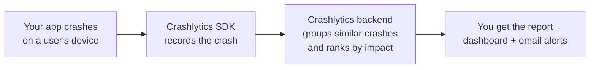

---

## 3. Hands-On Setup

Time to wire it into a real project. Most of the work is adding a few lines to your `main` function.

### Step 1. Create a new Firebase project

Head to the Firebase console and create a new project to hold your app's data.

<p align="center">
  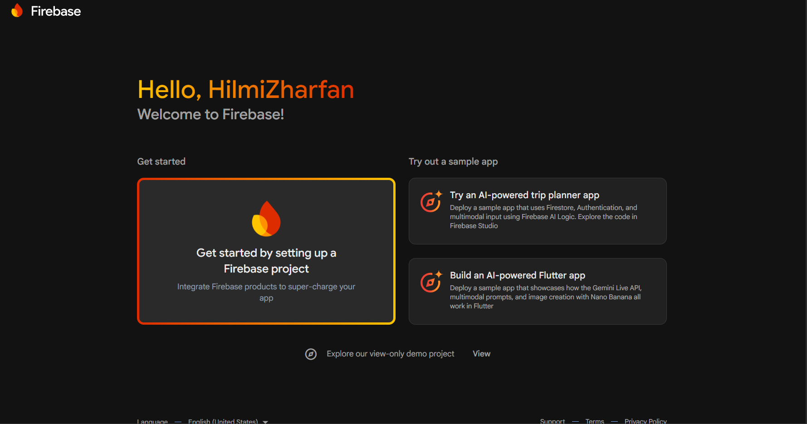
</p>

<p align="center">
  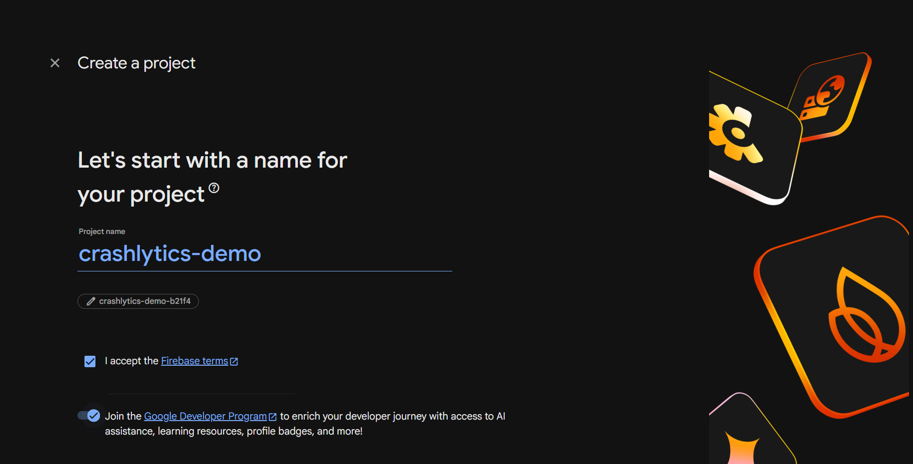
</p>

### Step 2. Add the packages

In your project directory, pull in the two packages you need:

```bash
flutter pub add firebase_crashlytics firebase_core
flutter pub get
```

`firebase_core` is the base connection to Firebase, and `firebase_crashlytics` is the crash reporter itself.

### Step 3. Connect your project to Firebase

Install the FlutterFire CLI and run the configure command. This links your local Flutter project to the Firebase project you just made, and generates a `firebase_options.dart` file for you.

```bash
dart pub global activate flutterfire_cli
flutterfire configure
```

### Step 4. Add the imports to `main.dart`

```dart
import 'dart:ui';
import 'package:firebase_crashlytics/firebase_crashlytics.dart';
```

### Step 5. Update your `main` function

After initializing Firebase, hook Crashlytics into two error channels. You're catching errors from **two different layers**. One is the Flutter framework, the other is the platform underneath it (native Android/iOS). Both can crash, so both need to be wired up.

This diagram maps each handler to the kind of error it catches. It's why there are two of them, not one:

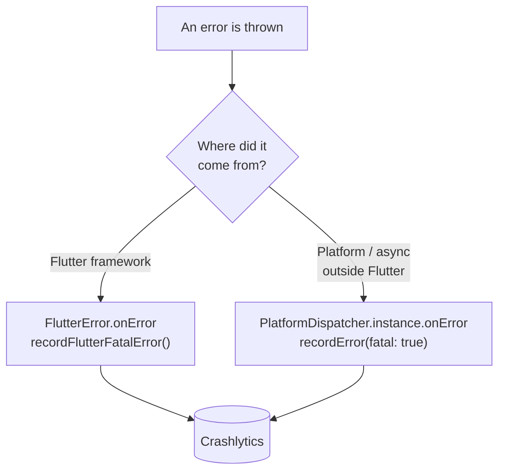

```dart
Future main() async {
  WidgetsFlutterBinding.ensureInitialized();
  await Firebase.initializeApp(
    options: DefaultFirebaseOptions.currentPlatform,
  );

  // Pass all uncaught "fatal" errors from the framework to Crashlytics
  FlutterError.onError = (errorDetails) {
    FirebaseCrashlytics.instance.recordFlutterFatalError(errorDetails);
  };

  // Pass all uncaught asynchronous errors that aren't handled by
  // the Flutter framework to Crashlytics
  PlatformDispatcher.instance.onError = (error, stack) {
    FirebaseCrashlytics.instance.recordError(error, stack, fatal: true);
    return true;
  };

  runApp(const MyApp());
}
```

### Step 6. The full `main.dart`

Put together, your file looks like this:

```dart
import 'dart:ui';
import 'package:crashlytics_demo_v1/screens/home_page.dart';
import 'package:firebase_core/firebase_core.dart';
import 'package:flutter/material.dart';
import 'firebase_options.dart';
import 'package:firebase_crashlytics/firebase_crashlytics.dart';

Future main() async {
  WidgetsFlutterBinding.ensureInitialized();
  await Firebase.initializeApp(
    options: DefaultFirebaseOptions.currentPlatform,
  );

  // Pass all uncaught "fatal" errors from the framework to Crashlytics
  FlutterError.onError = (errorDetails) {
    FirebaseCrashlytics.instance.recordFlutterFatalError(errorDetails);
  };

  // Pass all uncaught asynchronous errors that aren't handled by
  // the Flutter framework to Crashlytics
  PlatformDispatcher.instance.onError = (error, stack) {
    FirebaseCrashlytics.instance.recordError(error, stack, fatal: true);
    return true;
  };

  runApp(const MyApp());
}

class MyApp extends StatelessWidget {
  const MyApp({super.key});

  @override
  Widget build(BuildContext context) {
    return MaterialApp(
      title: 'Flutter Demo',
      theme: ThemeData(
        colorScheme: ColorScheme.fromSeed(seedColor: Colors.deepPurple),
      ),
      home: const HomePage(),
    );
  }
}
```

That's the whole setup. Don't memorize the snippet. Remember the shape: initialize Firebase, then route framework errors and platform errors into Crashlytics.

---

## 4. Checking That It Works

Before you trust a safety net, you test it. Don't wait for a real crash to find out whether Crashlytics is even connected.

The trick is to **force a test crash on purpose**. The simplest way is a button that throws an exception when pressed:

```dart
TextButton(
  onPressed: () => throw Exception(),
  child: const Text("Throw Test Exception"),
),
```

### Option A: One page

Drop the button straight into your home page inside a `Center` widget:

```dart
import 'package:flutter/material.dart';

class HomePage extends StatelessWidget {
  const HomePage({super.key});

  @override
  Widget build(BuildContext context) {
    return Scaffold(
      body: Center(
        child: TextButton(
          onPressed: () => throw Exception(),
          child: const Text("Throw Test Exception"),
        ),
      ),
    );
  }
}
```

### Option B: Two pages

Or make it slightly more realistic with two pages. The home page navigates to a second page, and the second page is where the exception gets thrown. This is closer to how a real crash happens, deeper inside a user's journey rather than on the first screen.

```dart
import 'package:crashlytics_demo_v1/screens/second_page.dart';
import 'package:flutter/material.dart';

class HomePage extends StatelessWidget {
  const HomePage({super.key});

  @override
  Widget build(BuildContext context) {
    return Scaffold(
      body: Center(
        child: TextButton(
          onPressed: () => Navigator.push(
            context,
            MaterialPageRoute(builder: (context) => SecondPage()),
          ),
          child: const Text("Go to second page"),
        ),
      ),
    );
  }
}
```

```dart
import 'package:firebase_crashlytics/firebase_crashlytics.dart';
import 'package:flutter/cupertino.dart';
import 'package:flutter/material.dart';

class SecondPage extends StatelessWidget {
  const SecondPage({super.key});

  @override
  Widget build(BuildContext context) {
    return Scaffold(
      body: Center(
        child: Column(
          children: [
            ElevatedButton(
                onPressed: () => throw FormatException("Format Exception Triggered"),
                child: Text("Trigger Format Exception")
            ),
            ElevatedButton(
                onPressed: () {FirebaseCrashlytics.instance.crash();},
                child: Text("Trigger crash using Crashlytics instance")
            ),
          ],
        ),
      ),
    );
  }
}
```

### Reading the terminal output

Run the app and press the button. You'll see a long stack trace in your terminal logs. Don't panic at the wall of text. The part that matters sits at the bottom:

```text
======== Exception caught by gesture ===============================================================
The following FormatException was thrown while handling a gesture:
Format Exception Triggered

When the exception was thrown, this was the stack:
#0      SecondPage.build.<anonymous closure> (package:crashlytics_demo_v1/screens/second_page.dart:12:30)
#1      _InkResponseState.handleTap (package:flutter/src/material/ink_well.dart:1185:21)
...
====================================================================================================
I/TRuntime.CctTransportBackend( 8403): Making request to: https://crashlyticsreports-pa.googleapis.com/v1/firelog/legacy/batchlog
I/TRuntime.CctTransportBackend( 8403): Status Code: 200
```

Those **final two lines are the proof**. They say the app made a request to Crashlytics to record the crash, and got back a `200` status code, which means success. If you see that, your setup works.

> Notice the first line of the stack trace points straight at `second_page.dart:12`, the exact line and column where the exception came from. That pinpointing is the whole reason we use a crash reporter.

---

## 5. Reading the Reports in Firebase

Now the Firebase side. In the Firebase console, open the sidebar and go to **DevOps & Engagement → Observability → Crashlytics**.

<p align="center">
  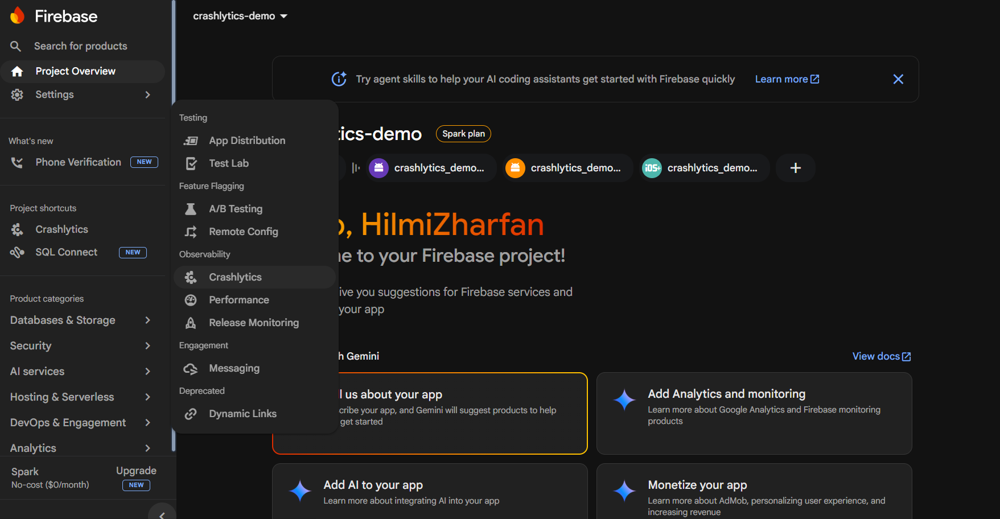
</p>

The dashboard shows you the essentials up front: which Android app this is connected to, the number of crashes, and a **table of issues**.

<p align="center">
  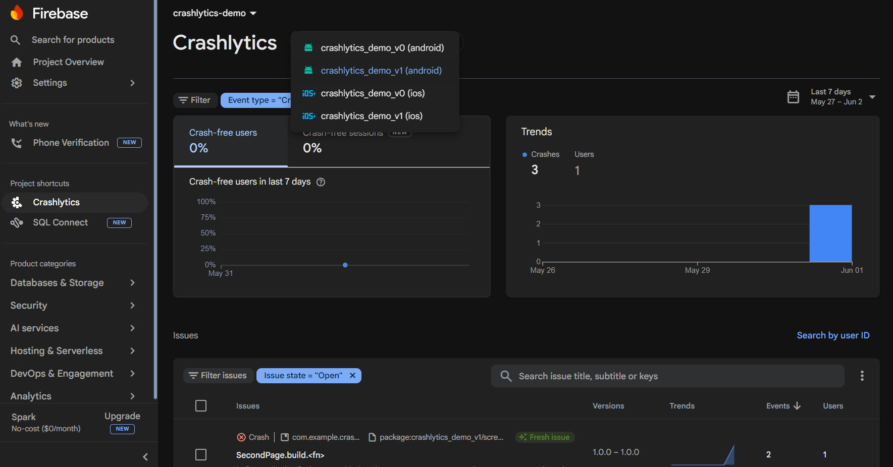
</p>

<p align="center">
  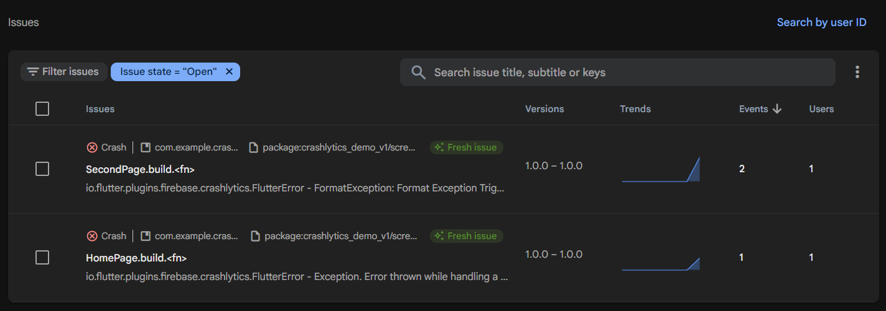
</p>

Click any issue to open its detail page, where you can dig into the stack trace, affected devices, and how often it happens.

<p align="center">
  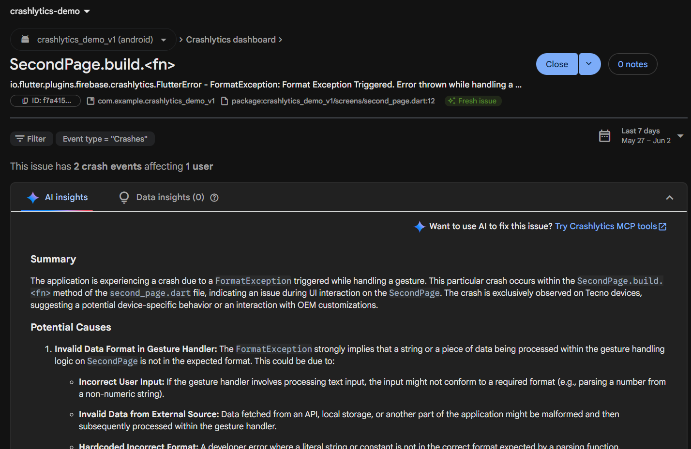
</p>

<p align="center">
  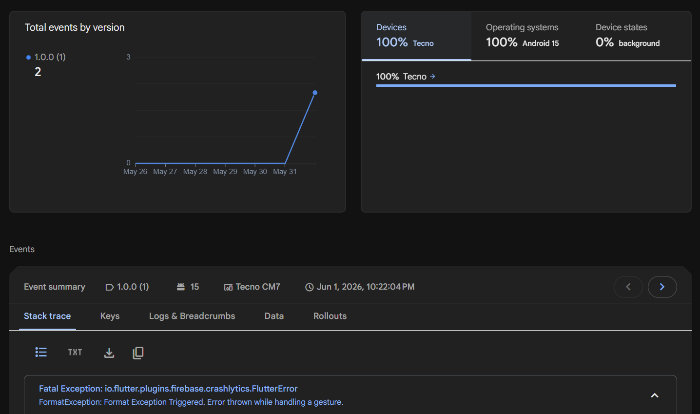
</p>

### Event types

You'll notice not all crashes are the same. Crashlytics records different **types of events**:

| Event type | What it means |
|------------|---------------|
| **Fatal** | A real crash. The app went down. |
| **Non-fatal** | Something went wrong, but the app kept running. |

And crashes can come from different layers:

- **Flutter crashes** are problems in the Dart code you wrote.
- **Native crashes** happen down in the Android or iOS layer.

Knowing the type and the layer tells you a lot before you even read the stack trace, since a native crash and a Flutter crash usually need different fixes.

> **iOS note:** for Apple builds, Crashlytics needs **dSYM files** to turn the cryptic crash addresses into readable function names. Firebase will email you if it's missing them.

---

## 6. Logging Your Own Errors (Business Logic)

So far we've only caught crashes that happen *to* us. But some errors we can see coming. These are **business logic errors**, the predictable failure points in our own app logic.

Crashlytics gives you an API to **log these expected exceptions yourself**, without crashing the app. You decide what gets recorded.

Picture a weather app as the running example. Two scenarios to track:

- **Validating the URL.** Our app builds a weather API URL using input the user typed in. User input is untrustworthy, so the URL might be malformed. We want to know when that happens.

<p align="center">
  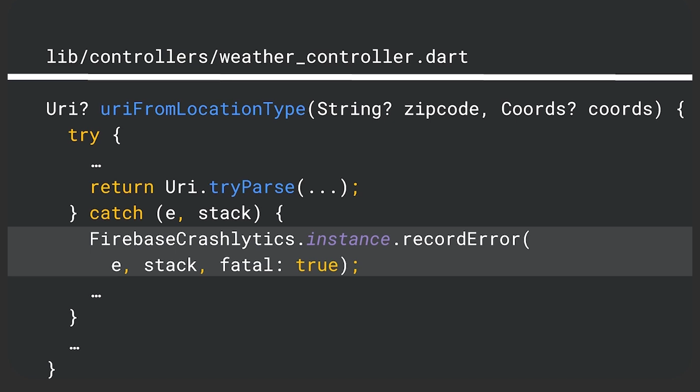
</p>

- **Asking for location permission.** Before we query the user's coordinates through the system API, we need their permission. If they say no, that's not a crash, but it's something we want to log.

<p align="center">
  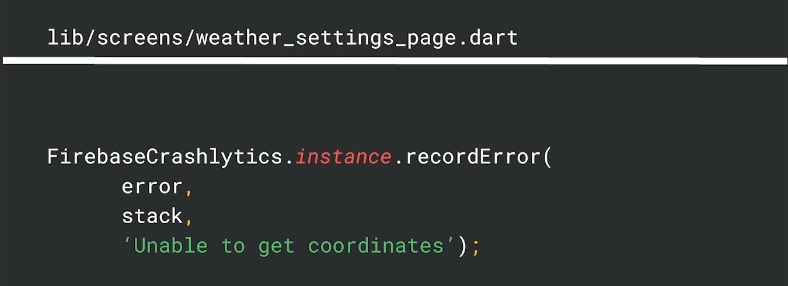
</p>

You work with **two logging functions**, a "wide net" pair that catches general errors in these error-prone scenarios.

### Fatal vs Non-Fatal: how to decide

Map your exceptions to whether the event was **expected** or **unexpected**:

- **Unexpected → Fatal.** Anything that bubbles all the way up to a top-level exception handler is something you didn't see coming. Record it as fatal.
- **Expected → Non-fatal.** Something you saw coming and handled. Log it as non-fatal so you can watch how often it happens.

There's also a **Fatal API** for *reporting high-priority issues immediately*, rather than recording them quietly.

This matters because of how reports get sent. On traditional platforms, a crash report only goes out **after the app restarts** following the crash. But **Flutter errors usually don't crash the app**, so that restart never happens, and the report never gets sent on its own.

The Fatal API solves this. The moment you log an exception and label it high-priority through the Fatal API, it gets reported to Crashlytics **right away**, on demand. No restart needed.

The whole decision, in one table:

| What happened | Expected? | Record as | How | Weather-app example |
|---|---|---|---|---|
| Reaches a top-level handler | No | Fatal | Caught for you by the `main()` setup | Any uncaught exception that crashes the app |
| A known risk you handled | Yes | Non-fatal | One of the two logging functions | User denies location permission |
| A known issue serious enough to report now | Yes | Fatal | Fatal API, on demand | A malformed weather URL that breaks the core feature |

---

## 7. 🤟 Velocity Alerts 🤟

You don't want to babysit the dashboard. **Velocity alerts** watch for you and email you when something is spreading fast.

<p align="center">
  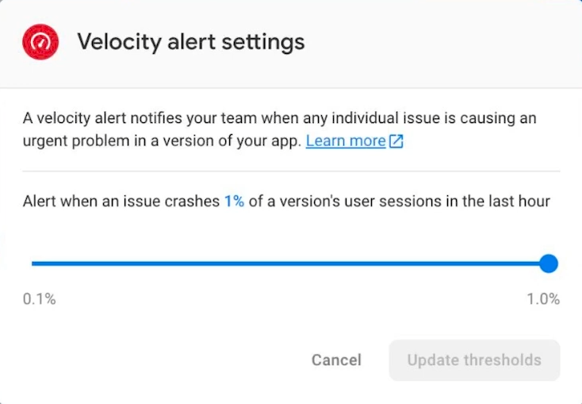
</p>

A velocity alert fires when an issue **crashes a meaningful percentage of a version's user sessions within the last hour**. For example, when **1% of all user sessions** are affected by a single issue, you get an email.


<p align="center">
  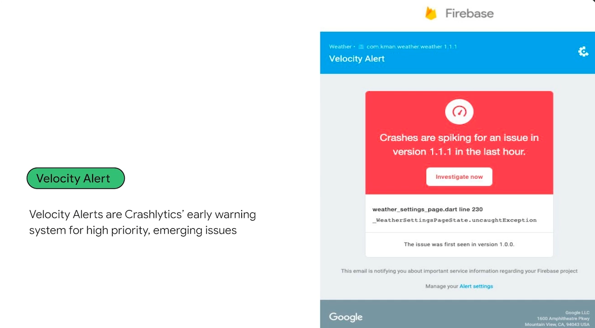
</p>

The goal is to catch **high-impact, emerging problems early**, before they snowball. A bug that breaks 1% of sessions in an hour is exactly the kind of thing you want flagged the moment it starts.

> Example: a velocity alert could fire because an exception keeps getting logged while validating the URL, since the app keeps failing to resolve user-supplied zip codes.

---

## 8. The Metric That Matters: Crash-Free Users

If you only watch one number, watch **crash-free users**.

<p align="center">
  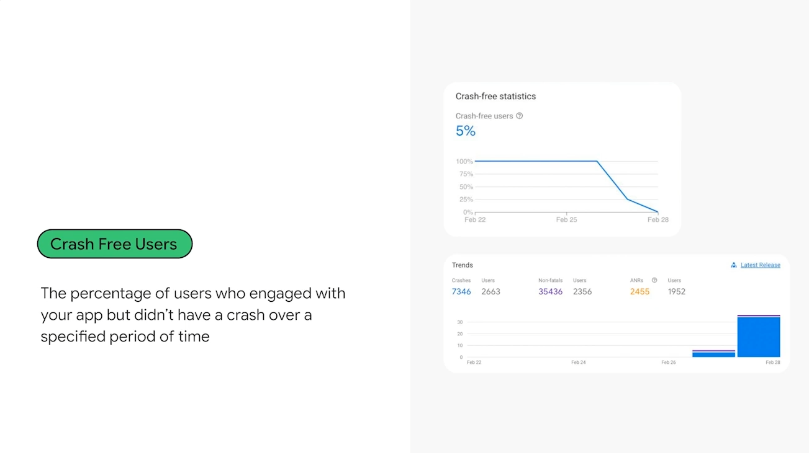
</p>

It's the percentage of your users who are *not* experiencing a crash. The more users hit a crash, the lower this number drops.

It's a blunt health check. 99.5% crash-free is healthy. Watch it slide to 95% and you know something just broke for a lot of people.

---

## 9. How Crashes Get Grouped

Remember the big promise from the start: Crashlytics groups similar crashes into a single **issue** instead of drowning you in duplicates. How does it decide what counts as "similar"?

<p align="center">
  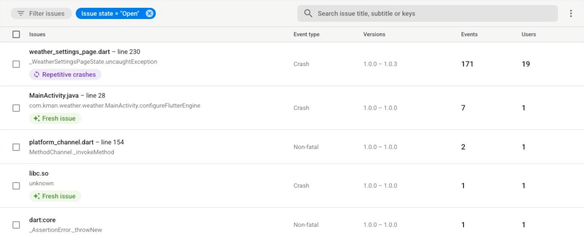
</p>

It looks at the stack trace, the chain of function calls that led to the crash, and tries to find the frame that caused the problem.

To do that, it **deprioritizes frames that are unlikely to be the culprit.** Most frames in a stack trace are framework or system code that's the same for everyone. Those aren't where *your* bug lives. By pushing them aside, Crashlytics zeroes in on the line in *your* code that's the real cause, and groups all crashes sharing that cause together.

That's what turns thousands of raw crash reports into a short, fixable to-do list.

---

## Quick Recap

- Crashes are inevitable. You need to find them, understand them, and rank them by impact.
- **Crashlytics** is a real-time crash reporter that groups similar crashes and ranks them by how many users they hit.
- Setup is a few lines in `main`, catching errors from both the **Flutter** and **platform** layers.
- Test it by **forcing a crash** on a button press, then confirm the `Status Code: 200` in your logs.
- Events are **fatal** (real crash) or **non-fatal** (handled). Map **unexpected → fatal**, **expected → non-fatal**.
- Use the **Fatal API** to report high-priority Flutter errors right away, since Flutter errors don't restart the app.
- **Velocity alerts** email you when a problem spreads fast.
- **Crash-free users** is your headline health metric.
- Crashes are **grouped** by deprioritizing irrelevant frames to find the real cause.

---

## Demo Project Example
https://github.com/hilmizr/mobile-crashlytics-demo-app

---

## References

- [Get started with Crashlytics for Flutter (Firebase docs)](https://firebase.google.com/docs/crashlytics/flutter/get-started)
- [Video: Firebase Crashlytics (Package of the Week)](https://www.youtube.com/watch?v=1wBpX0iFl5E)
- [Video: Monitor crash logs in flutter apps easily using Crashlytics Package](https://youtu.be/p4pmAGn1Y00)
- [Video: Monitoring your Flutter app's stability with Firebase Crashlytics](https://www.youtube.com/watch?v=cIFLFpKTy7c)

